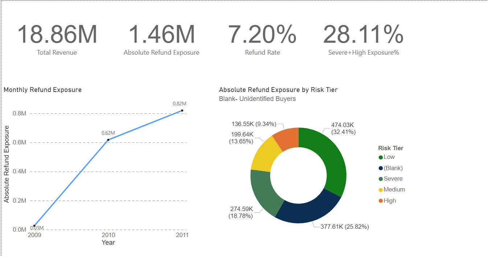
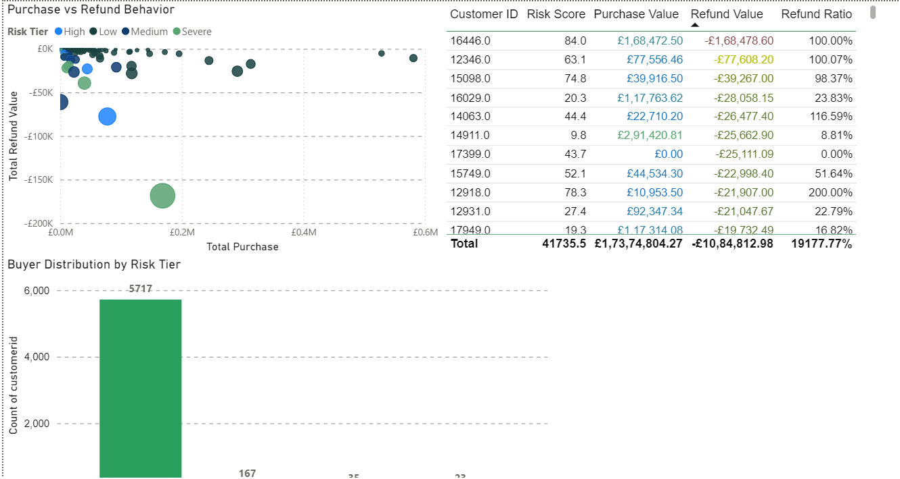
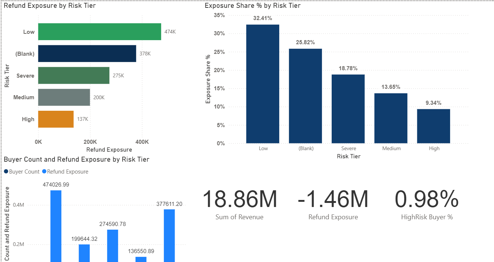
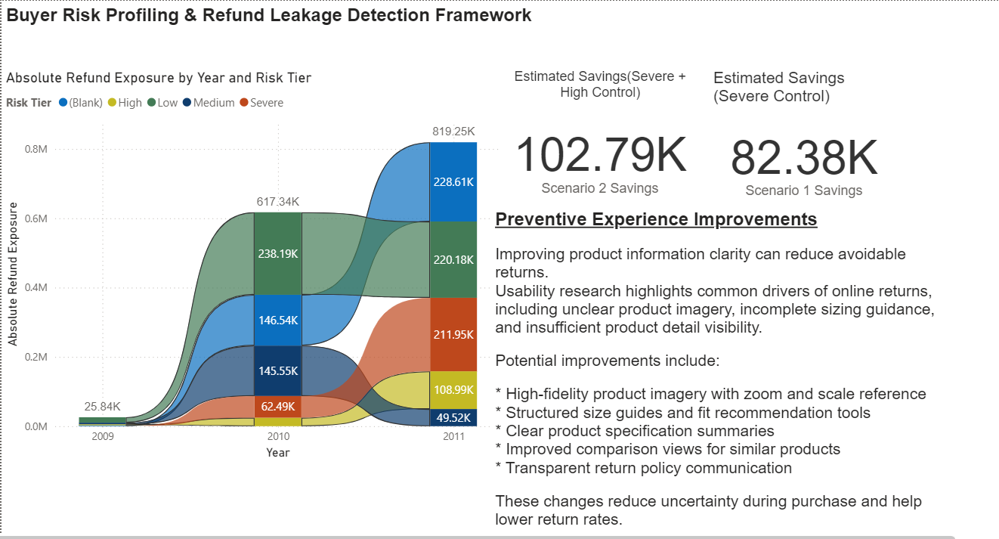

# Buyer Risk Profiling & Refund Leakage Detection

##Project Overview
- This project develops an operational analytics framework to identify high-risk buyer behavior and quantify refund leakage in e-commerce environments.
Using transaction-level retail data, the analysis detects refund concentration patterns, classifies buyers into risk tiers, and simulates targeted governance strategies to reduce operational losses.

##Business Problem
- E-commerce platforms experience margin erosion due to high return rates and refund abuse patterns.
- While flexible return policies improve customer trust, they also create opportunities for behavioral exploitation and operational inefficiencies.
- The objective of this project is to identify concentrated refund risk patterns and support operational decision-making through data-driven insights.

##Dataset
Dataset: Online Retail II  
Source: UCI Machine Learning Repository
The dataset contains transactional records of an online retail store including invoice data, product details, quantities, prices, and customer identifiers.

##Tools Used
SQL (PostgreSQL)
Power BI

##Analytical Framework
-Data Cleaning and Validation
 - Transaction Aggregation
 - Buyer Behavioral Analysis
 - Risk Scoring Model
 - Leakage Concentration Analysis
 - Policy Simulatio 

##Risk Scoring Logic 
- Refund Frequency
- Refund Value Ratio
- Refund Volume Exposure
- Customer Behavioral Lifespan

Buyers are classified into four tiers: 
- Low
- Medium
- High
- Severe

##Key Insight
- The analysis reveals a strog concentration pattern where a very small percentage of buyers (1%) contribute a ~38% of refund exposure 
This suggests that targeted operational controls can significantly reduce refund-related operational costs without imacting the majority of customers. 

##Dashboard 
- The Power BI dashboard provides: 
 - Executive refund performance overview 
 - Buyer risk segmentation
 - Refund leakage concentration analysis
 - Policy simulation for targeted operational interventions. 

 ### Executive Overview

### Buyer Risk Segmentation

### Leakage Concentration

### Policy Simulation

##Strategic Recommendations
Operational Controls
- Monitor High-risk buyers
- Introduce tier-based refund governance
- Apply manual review for severe risk cases
Experience Improvements
- Improve product information clarity
- Provide better sizing guidance
- Enhance product imagery and specifications

 

 

